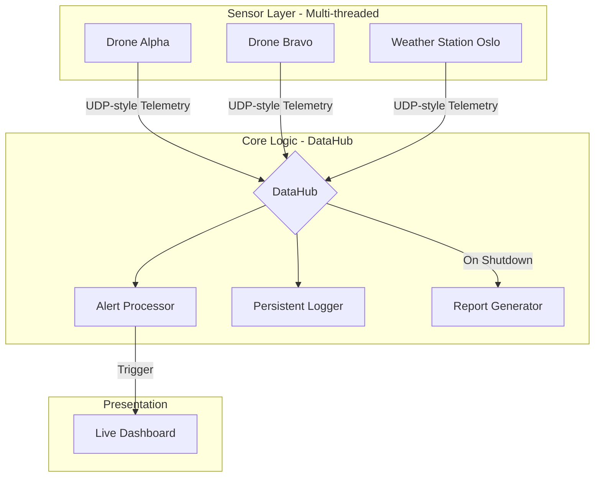

# SensorFleetSim

A real-time IoT fleet simulator written in Java. The project models a network of autonomous sensors (drones and weather stations) communicating with a central telemetry processing hub.

## System Architecture

The project implements a **Centralized Mediator Pattern**. Independent sensor entities operate on dedicated threads, pushing telemetry to a thread-safe `DataHub`.

### Data Flow & Component Interaction


## Key Engineering Features

- **Advanced concurrency** – uses `ExecutorService` for thread lifecycle management and `ConcurrentHashMap`/`CopyOnWriteArrayList` for lock-free, thread-safe state.
- **Automated Engineering Reports** – Generates standardized Markdown reports upon shutdown, including system metadata (OS, Java version) and incident distribution charts via Mermaid.
- **Polymorphic telemetry** – `BaseSensor` makes it easy to add new sensor types.
- **Non-blocking I/O** – `FleetManager` polls `System.in` while refreshing the dashboard at 1 Hz.
- **Real time risk analysis**
  - Battery check (warning below 20 %)
  - Flight safety (altitude threshold)
  - Meteorological alerts (wind-speed storm detection)
- **Persistent logging** – every report and alert is appended to `telemetry_log.txt` safely.

## Engineering Report Preview
**When the system shuts down, it generates a formal `session_report.md`. Below is a preview of the automated output:**


## Class Architecture

The main classes are:

```text
classDiagram
    class BaseSensor {
        <<abstract>>
        #String id
        #double batteryLevel
        +run()
        +collectData()*
        +getStatusReport()*
    }
    class DroneSensor {
        -double altitude
        +collectData()
        +getStatusReport()
    }
    class WeatherSensor {
        -double windSpeed
        +collectData()
        +getStatusReport()
    }
    class DataHub {
        -ConcurrentHashMap latestReports
        +receiveData(String report)
        +renderDashboard()
        -processAlerts(String report)
        +showSummary()
    }
    class ReportGenerator {
        +generateMarkdownReport()
    }
    
    BaseSensor <|-- DroneSensor
    BaseSensor <|-- WeatherSensor
    BaseSensor o-- DataHub : communicates with
    DataHub --> ReportGenerator : triggers
    FleetManager --> DataHub : initializes
```

## Installation & Usage
### Prerequisites

- Java JDK 17 or higher

### Build & Run

```bash
# clone repository
git clone https://github.com/Kefmat/SensorFleetSim.git
cd sensor-fleet-sim

# compile source files
javac src/*.java

# execute simulator
java -cp . src.FleetManager
```

### Controls

- **Monitoring** – dashboard updates every 1000 ms
- **Shutdown** – type `exit` and press Enter to stop the simulation and display a summary
```bash
java -Dreport.file=MISSION_ALPHA.md -cp . src.FleetManager
```
- **Custom Reports** - You can specify the output filename using a system property:

## Sample Dashboard

```
=== SENSOR FLEET DASHBOARD ===
------------------------------------------------------------
ID              | BATTERY    | TELEMETRY                
------------------------------------------------------------
DRONE-Alfa      | 88.5%      | Alt: 102.4m             
STATION-Oslo    | 99.1%      | Temp: 14.2C | Wind: 16.5m/s
------------------------------------------------------------
Status: 42 reports received. Type 'exit' to stop.
> 
```
This project serves as a demonstration of Concurrent Systems, Object-Oriented Design (OOD), and Real-time Data Ingestion in Java.
