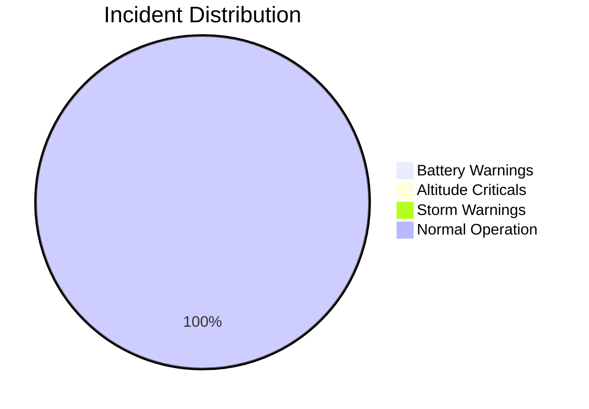

# Engineering Session Report
### Generation Timestamp: 2026-02-25 16:49:14

---

## 1. System Metadata
- **Java Version:** 23.0.1
- **Operating System:** Windows 11
- **Session ID:** 1772034554682

## 2. Fleet Status Visualization
The following chart visualizes the distribution of incidents during this session:

## 3. Technical Statistics
| Metric | Value |
| :--- | :--- |
| Total Packets Processed | 43 |
| Minimum Battery Observed | 50,1% |
| Peak Wind Velocity | 7,2 m/s |

## 4. Safety Performance Analysis
- Battery Health: Optimal
- Flight Safety: Nominal
- Environmental Conditions: Stable

---
*Automated Report Service - SensorFleetSim Core*
